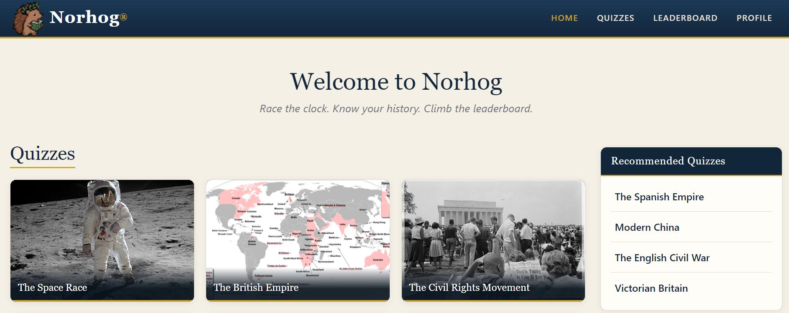

# Norhog

Norhog is a full-stack history quiz site. Players race the clock to type answers
to fill-in-the-blank questions, and signed-in players earn points toward a
leaderboard that updates live over WebSockets.

[](https://github.com/RyGuy907/norhog/actions/workflows/ci.yml)

**Live site:** [norhog.com](https://norhog.com)



It runs on AWS with 183 quizzes, server-checked scoring, an admin quiz builder,
and a pipeline that tests and deploys every push to `main`. It began as my
startup project for a BYU course, and most of what is here was built after that
course ended.

## Features

- **Timed quizzes.** 20 questions at each of three difficulties, on a 6, 8, or 10
  minute clock. An answer is revealed the moment it's typed, and guesses are
  matched loosely: case, accents, punctuation, a leading "the", roman numerals,
  and per-question alternate spellings.
- **Live leaderboard.** Finishing a scored run updates every open leaderboard
  over a WebSocket, with no refresh.
- **Accounts.** bcrypt-hashed passwords and httpOnly session cookies. Anyone can
  play; signing in is what makes a run count. Players can delete their account
  and all its data.
- **Admin quiz builder.** Quizzes live in MongoDB, not in the code, and images
  upload from the browser straight to S3 through presigned URLs. Players can
  suggest quizzes, which admins review.
- **Boards.** Fastest perfect runs per difficulty, your own bests, and the most
  played quizzes site-wide and per player.

## Tech stack

| Layer | Tools |
|---|---|
| Frontend | React 19, React Router 7, Bootstrap 5, Vite |
| Backend | Node.js 22, Express 5, `ws` |
| Data | MongoDB Atlas, Amazon S3 (quiz images) |
| Testing | Vitest, React Testing Library, supertest |
| Hosting | AWS EC2, Caddy (HTTPS and reverse proxy), pm2 |
| CI/CD | GitHub Actions, OIDC federation into AWS, S3, SSM |

## Architecture

```
React SPA (Vite) ──HTTP──> Express REST API ──> MongoDB Atlas
     │                         │    │           (users, quizzes, scores, suggestions)
     │                         │    └─────────> S3 (presigned image uploads)
     └────────WebSocket────────┘
       (server pushes leaderboard updates)
```

The app lives in [startup_react/](startup_react/), with the frontend in
[src/](startup_react/src/) and the backend in
[service/](startup_react/service/). In production Express also serves the built
frontend, and Caddy sits in front of it for HTTPS.

| File | Purpose |
|---|---|
| [service/index.js](startup_react/service/index.js) | REST endpoints, auth middleware, attempt tracking, static hosting |
| [service/database.js](startup_react/service/database.js) | MongoDB queries and aggregations |
| [service/security.js](startup_react/service/security.js) | Request sanitization, type-checked field reads, rate limiting |
| [service/answerLock.js](startup_react/service/answerLock.js) | Locks answers before they are sent to the browser |
| [service/answerMatch.js](startup_react/service/answerMatch.js) | Normalizes answers and expands accepted variants |
| [service/scoreBroadcaster.js](startup_react/service/scoreBroadcaster.js) | WebSocket server for leaderboard updates |
| [service/imageStore.js](startup_react/service/imageStore.js) | S3 presigned upload URLs |
| [service/seedData.js](startup_react/service/seedData.js) | The 183 starter quizzes, inserted at boot if missing |

## How scoring works

Pressing Play asks the server for a single-use attempt token, and the server
records when the run started. When the run ends, the browser sends the token and
its score. The server takes the elapsed time from its own clock and rejects the
result if the token was already used, belongs to another account, arrived after
the time limit, or claims answers faster than a person could type them.

Each quiz is worth up to 10 points. Easy runs max out at 6 points, medium at 8,
and hard at 10, scaled by the fraction answered. Only a player's best result on
each quiz counts toward their total, so replaying can raise a score but never
stack it.

The payload the browser receives holds no readable answers. Each accepted
spelling arrives as a salted digest plus a ciphertext keyed by that spelling, so
the page can only decrypt an answer someone actually guessed, and matching a
guess costs no network request. The rest are released when the run ends.

## Security

Request bodies, query strings, cookies, and route params are scrubbed of MongoDB
operator keys before any route sees them, and the database helpers reject
non-string lookups as a second layer. Passwords are bcrypt-hashed, login is
constant-time whether or not the email exists, and session tokens rotate on
login and expire after 7 days on the server as well as in the browser. Login and
writes are rate limited per IP. Public boards return display names only, so
emails and hashes never leave the server. No credentials are stored in the
repository.

[docs/SECURITY-NOTES.md](startup_react/docs/SECURITY-NOTES.md) has the detail,
including the attacks each measure is for and the gaps that remain.

### Known limitations

The score check limits what a modified client can claim, but it doesn't make
cheating impossible. A script could still report a perfect score after waiting
long enough to pass the timing check. Checking each guess on the server would
close that gap, but it would cost a request per answer, and I chose to keep
matching local. Similarly, the answer locks keep answers out of casual view in
the network tab, but short answers like years could be brute-forced offline by
someone determined to.

## Tests

107 tests run in CI on every push. They are weighted toward the backend, which
is where the logic worth breaking lives: 82 service tests cover about 75% of
`index.js` and 91% of `security.js`, against 25 on the frontend.

- **Integration tests** drive the real Express app with supertest, stubbing only
  the database. They cover registration and login, session expiry, admin
  authorization, the full attempt flow, account deletion, and injection attempts
  including an operator smuggled through a cookie. The rules that make scores
  hard to fake get their own suite: runs claimed too fast, submitted too late,
  replayed, or finished from another account are each rejected.
- **Unit tests** cover guess normalization and roman numerals, shuffling,
  request sanitization, rate limiting, and the WebSocket origin check.
- **Contract tests** check the browser's answer unlocking against a
  re-implementation of the server's locking, so the two halves can't drift apart.
- **Component tests** render `QuizCard` with React Testing Library. This is the
  thin part: the page components have no tests yet.

```bash
cd startup_react
npm test                  # frontend
cd service && npm test    # backend
```

## Running locally

You need Node 22 and a MongoDB Atlas cluster (the free M0 tier works). Every
command below runs from `startup_react/`.

1. Copy [service/dbConfig.example.json](startup_react/service/dbConfig.example.json) to
   `service/dbConfig.json` and fill in your Atlas hostname, user, and password.
   The file is gitignored. Set `"dbName"` to something like `"quiz-dev"`, since it
   defaults to `quiz`. The `s3Bucket` and `s3Region` fields are optional; without
   them the admin form only accepts pasted image URLs.
2. Start the backend from `service/`, since static paths are relative to it:
   ```bash
   cd service
   npm install
   npm start
   ```
3. In another terminal, start the frontend dev server. It proxies `/api` and `/ws`
   to port 4000.
   ```bash
   npm install
   npm run dev
   ```
4. Open http://localhost:5173.

To fill a local database with players and play history, run
`node seedDevData.mjs` from `service/`. It refuses to run against the `quiz`
database.

### Making an admin

There is no way to sign up as an admin. Register normally, then add
`"role": "admin"` to your user document in Atlas. The Admin link appears on the
next page load.

## Seed data

The 183 quizzes are seeded at boot from `service/seedData.js`, which only
inserts slugs that are missing so admin edits are kept. The live leaderboard is
also seeded with 18 fictional players, whose accounts cannot be signed into, so
the boards aren't empty. [docs/SEED-DATA.md](startup_react/docs/SEED-DATA.md)
covers the seeding and sync scripts.

## Deployment

Pushing to `main` runs lint, both test suites, and a production build. If they
pass, GitHub Actions builds a bundle, uploads it to S3, and uses SSM to run
[deployFromS3.sh](startup_react/deployFromS3.sh) on the EC2 instance. That script installs
dependencies, restarts the service, checks that the port answers, and rolls back
to the previous release if anything fails. GitHub never opens a connection to the
server, so SSH stays closed to the internet.

[docs/DEPLOY.md](startup_react/docs/DEPLOY.md) covers the one-time AWS, Atlas, DNS, and Caddy
setup. [deployService.sh](startup_react/deployService.sh) is a manual SSH deploy for first-time
setup.

## License

[MIT](LICENSE)
